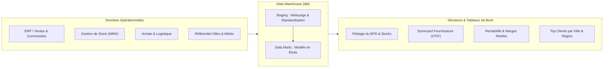
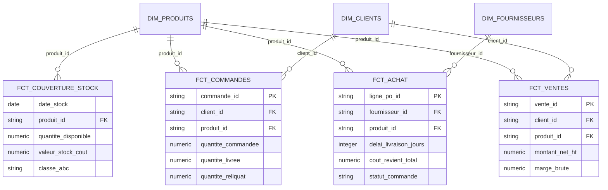

# 📦 Modern Data Warehouse & BI Supply Chain pour TPE / PME

> **Portfolio & Démo Technique**  
> Transformation de données opérationnelles en indicateurs décisionnels pour optimiser le **BFR (Besoin en Fonds de Roulement)**, fiabiliser la **Supply Chain** et maximiser la **rentabilité commerciale**.

---

## 🎯 Enjeux & Problématiques Dirigeants

Pour une TPE ou PME dans le négoce, la distribution ou la production, la trésorerie et la satisfaction client dépendent directement de la maîtrise de la chaîne logistique :

* **Trésorerie immobilisée :** Combien de capital dort inutilement dans des stocks à faible rotation ?
* **Ruptures et ventes perdues :** Quels produits à forte marge manquent au moment opportun à cause de délais fournisseurs sous-estimés ?
* **Fiabilité des fournisseurs :** Quels partenaires respectent réellement leurs engagements de délais (Lead Times) et de volumes ?
* **Visibilité des coûts réels :** Quel est le coût de revient complet (*Landed Cost* : achat + transport + stockage) par produit et par commande ?
* **Performance commerciale par zone géographique :** Quels sont nos meilleurs clients (Top CA & Marge) par ville et région ?

Ce projet démontre comment un **Data Warehouse moderne et léger (modélisé avec dbt)** structure l'ensemble de ces données pour alimenter directement des tableaux de bord interactifs (Power BI, Metabase, Tableau, Looker Studio).

---

## 💡 Valeur Ajoutée & Cas d'Usage Métier



### 1. Optimisation du BFR & Gestion des Stocks
* **Segmentation ABC dynamique :** Classification automatique des produits pour focaliser l'attention sur les 20% de références générant 80% de l'activité (Classe A) et purger le surstock dormant (Classe C).
* **Suivi de la disponibilité journalière :** Décomposition temps réel des volumes (`en stock`, `réservé`, `en transit`, `disponible à la vente`).
* **Valorisation du stock :** Suivi au jour le jour de la valeur financière du stock immobilisé au coût de revient.

### 2. Performance Fournisseurs & Logistique
* **Contrôle des Lead Times :** Analyse des écarts entre le délai théorique promis et le délai de livraison réel.
* **Taux de service & reliquats :** Mesure des volumes commandés vs reçus/livrés pour anticiper les litiges et ajuster les réassorts.
* **Coût logistique complet :** Imputation des coûts de transport par route logistique sur le coût de revient unitaire.

### 3. Pilotage Commercial & Rentabilité
* **Marge nette réelle :** Calcul des revenus nets déduits des remises commerciales et des coûts de base produits.
* **Top Clients & Performance Territoriale :** Identification des clients générant le plus de CA et de marge par ville et par région.

---

## 🏗️ Architecture du Modèle Décisionnel (Schéma en Étoile)

Le modèle de données est structuré pour être immédiatement exploitable par les outils de Business Intelligence :



### Tables du Data Mart (`models/marts/`)

| Type | Table / Modèle | Objectif Décisionnel |
| :--- | :--- | :--- |
| **Fait** | `fct_couverture_stock` | Suivi journalier des niveaux de stock, valorisation financière et classe ABC. |
| **Fait** | `fct_achat` | Suivi des commandes fournisseurs, analyse des délais réels et coûts totaux acheminés. |
| **Fait** | `fct_commandes` | Analyse du cycle de commande client, taux d'exécution et reliquats. |
| **Fait** | `fct_ventes` | Chiffre d'affaires brut/net, volumes vendus et rentabilité commerciale. |
| **Dimension** | `dim_produits` | Référentiel catalogue : coûts, prix de vente, caractéristiques logistiques. |
| **Dimension** | `dim_clients` | Segmentation client, nom de la ville et localisation régionale. |
| **Dimension** | `dim_fournisseurs` | Informations partenaires et conditions d'approvisionnement. |

---

## 📊 Tableaux de Bord Prêts à l'Emploi

Une fois les transformations appliquées, les tables alimentent 3 dashboards clés pour le comité de direction :

1. **Cockpit Trésorerie & Stocks :**
   * KPI : Montant global du stock immobilisé, part du stock en classe C (dormant).
   * Visualisation : Évolution temporelle du stock disponible vs réservé et alertes de niveau critique.
2. **Scorecard Achats & Fournisseurs :**
   * KPI : Délai moyen de livraison par fournisseur, taux de ponctualité, surcoûts transport.
   * Décision : Renégociation des conditions d'achat et choix des routes logistiques les plus rentables.
3. **Pilotage des Commandes & Portefeuille Clients :**
   * KPI : Taux de reliquat, marge nette par segment, classement des clients par chiffre d'affaires et ville.

---

## 🚀 Démonstration Technique

### Prérequis
* Un entrepôt de données (PostgreSQL, BigQuery, Snowflake, etc.)
* dbt Core (v1.0+)

### Exécution du pipeline
Pour compiler et exécuter l'ensemble des transformations du data warehouse :

```bash
# Exécution de l'ensemble des modèles (staging + marts)
dbt run

# Exécution ciblée des tables de faits pour le reporting
dbt run --select marts
```

---

## 💼 À propos de cette démonstration
Cette réalisation illustre la mise en place d'une infrastructure décisionnelle adaptée aux contraintes des **PME et TPE** :
* **Pragmatisme :** Pas d'usine à gaz technologique, mais un modèle de données propre, compréhensible et directement activable.
* **Rapidité de mise en œuvre :** Branchement sur les outils existants (ERP, fichiers de gestion, WMS).
* **ROI mesurable :** Libération de trésorerie sur les stocks et amélioration de la fidélité client par la réduction des ruptures.
